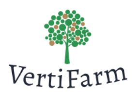

[![MIT License][license-shield]][license-url]
[![LinkedIn][linkedin-shield]][linkedin-url]

<!-- PROJECT LOGO -->
 

  

  

    A web platform to promote future of farming i.e. Vertical Farming
     
        
    <a href="https://github.com/Himank-J/">Report Bug</a>
    ·
    <a href="https://github.com/Himank-J/">Request Feature</a>
  

<!-- TABLE OF CONTENTS -->
## Table of Contents

* [About the Project](#about-the-project)
  * [Built With](#built-with)
* [Features](#features)
* [Purpose](#purpose)
* [Contributing](#contributing)
* [License](#license)
* [Contact](#contact)

<!-- ABOUT THE PROJECT -->
## About The Project

 

 Vertical farming is the practice of growing crops in vertically stacked layers. It often incorporates
controlled environment agriculture, which aims to optimize plant growth. Vertical farming is clearly the 
future of food production.Vertical farming can become the next big thing for India. There has been a growth in percentage of 
people making use of this practice and now would be the best time to start increasing awareness among 
individuals to learn and adopt the style of vertical farming.
As previously stated, land resource could become scarce in the near future. One of the biggest advantages 
of vertical farming is that it performed vertically i.e. in form of a stack. In easier terms farming is done in 
building shaped structure which consumes less land space. The 
climatic conditions have almost no impact on performance of vertical farming as it is performed in 
stacked shaped structure which is usually kept under a roof. Vertical farming does not make much use of 
soil for production which means that even though the chemicals used for growth are little more dangerous 
than the ones used in normal agricultural farming, it has zero impact on soil or land. The biggest factor 
which takes vertical farming ahead of normal farming is that it reduces the use of most important resource 
on earth i.e. Water. Vertical farming reduces water usage by 95% while generating a very good result 
which are all good signs towards a sustainable future. 

<h3>VertiFarm</h3>  

 VertiFarm provides a system to promote the application and usage of vertical farming which is the 
modern method of agriculture. VertiFarm is a website that provides users with a platform to learn about 
vertical farming. It gives an insight into what exactly vertical farming is, what it provides, why it is the 
future of food production along with information about how it is performed, what materials or 
equipment’s are required. To promote the usage, VertiFarm provides the users with facility to buy item or 
rent them which allows user to understand practical approach towards vertical farming.

### Built With
This application is built with love, dedication, coffee and:
* Java and Hibernate  

The entire project is made using JAVA programming language. To interact with database, hibernate is 
used. Hibernate ORM is an object-relational mapping tool for the Java programming language. It 
provides a framework for mapping an object-oriented domain model to a relational database. Hibernate 
not only takes care of the mapping from Java classes to database tables (and from Java data types to SQL 
data types), but also provides data query and retrieval facilities which means that all updates are also 
stored in database which can be retrieved as and when required.

* SQLyog  

SQLyog is a GUI tool for the RDBMS MySQL. SQLyog is an all-round Management Tool 
('GUI','Frontend') for MySQL. All the database tables are visible through SQLyog.

* XAMPP Server  

XAMPP is an abbreviation where X stands for Cross-Platform, A stands for Apache, M stands for
MYSQL, and the Ps stand for PHP and Perl, respectively. XAMPP helps a local host or server to test its website 
and clients via computers and laptops before releasing it to the main server.

## Features 
* Login/Register  

The system allows user to register and create a personalized profile on the website. This 
will allow the administrator to keep track of all the users. Admin can also login but cannot register.

* User Account Management  

Displays four tabs namely - Profile, Rent Request, Demo Request and My Order tab. The system allows users to view and update their profiles, and reflect changes in the database. This will help facilitate the process of buying or renting products. The system displays information about order status and history to customer. This will help the users keep track of the purchases made by them. It also gives updates on demonstration/Rent requests (if any), of the machinery requested by the users. Regular changes will keep the user posted about the demonstration they might have requested.

* Catalog/Product browsing  

The platform showcases a catalog listing all the products and services provided by the 
website. This will help users choose their desired products.

* Order Management  

The system allows users to view, create and cancel orders.
If a user adds an item to the cart, the system checks availability of that item in the 
inventory and add the item only when it’s available. This will help keep the inventory in check 
and avoid any discrepancies in the items of the cart and the inventory database. **This feature is only available for logged in users**

* Checkout  

The system displays all the items in the cart available for purchase, alongside their prices 
and the total cost of the cart.  If a user does not have an account the system shall prompt the user 
to create one. If the user already has an account but is not logged in, the system shall request 
the user to log in to their account.

<!-- Purpose -->
## Purpose 

The motivation behind building a system that promotes vertical farming and trades in its equipment is 
sustainable development. India, the fastest growing population in the world has an enormous demand 
of food, and in order to meet this demand a huge portion of the country’s land is harvested at an 
accelerated rate. If the country keeps up with this trend it will lose its arable land in the foreseeable 
future. A feasible solution in today’s growing technological industry is vertical farming, which aims to 
increase crop production while decreasing land consumption. Vertical farming as compared to the 
traditional method uses 95% less water and no pesticides, it incorporates heavy use of sensing 
technologies and data science, as well as machine vision and AI to grow crops better for both the 
environment and humanity. This system when implemented will act as an aid for people who have 
limited or no knowledge of vertical farming, and will provide them equipment and demonstrate its 
usage, to encourage the practice of this new method of farming. 

<!-- CONTRIBUTING -->
## Contributing

Contributions are what make the open source community such an amazing place to be learn, inspire, and create. Any contributions you make are **greatly appreciated**.

1. Fork the Project
2. Create your Feature Branch (`git checkout -b feature/AmazingFeature`)
3. Commit your Changes (`git commit -m 'Add some AmazingFeature'`)
4. Push to the Branch (`git push origin feature/AmazingFeature`)
5. Open a Pull Request

<!-- LICENSE -->
## License

Distributed under the MIT License. See `LICENSE` for more information.

<!-- CONTACT -->
## Contact

Himank Jain - [@itsme_himank09](https://instagram.com/itsme_himank09) - My Instagram  
Himank Jain - [himank-jain](https://www.linkedin.com/in/himank-jain/) - My LinkedIn   
Project Link: [https://github.com/Himank-J/Eagriculture](https://github.com/Himank-J/Eagriculture)

<!-- MARKDOWN LINKS & IMAGES -->
<!-- https://www.markdownguide.org/basic-syntax/#reference-style-links -->

[license-shield]: https://img.shields.io/github/license/othneildrew/Best-README-Template.svg?style=flat-square
[license-url]: https://github.com/othneildrew/Best-README-Template/blob/master/LICENSE.txt
[linkedin-shield]: https://img.shields.io/badge/-LinkedIn-black.svg?style=flat-square&logo=linkedin&colorB=555
[linkedin-url]: https://www.linkedin.com/in/himank-jain/
[product-screenshot]: images/search.png
* [Contact](#contact)
